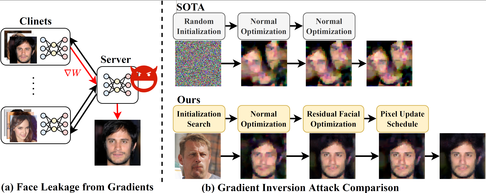
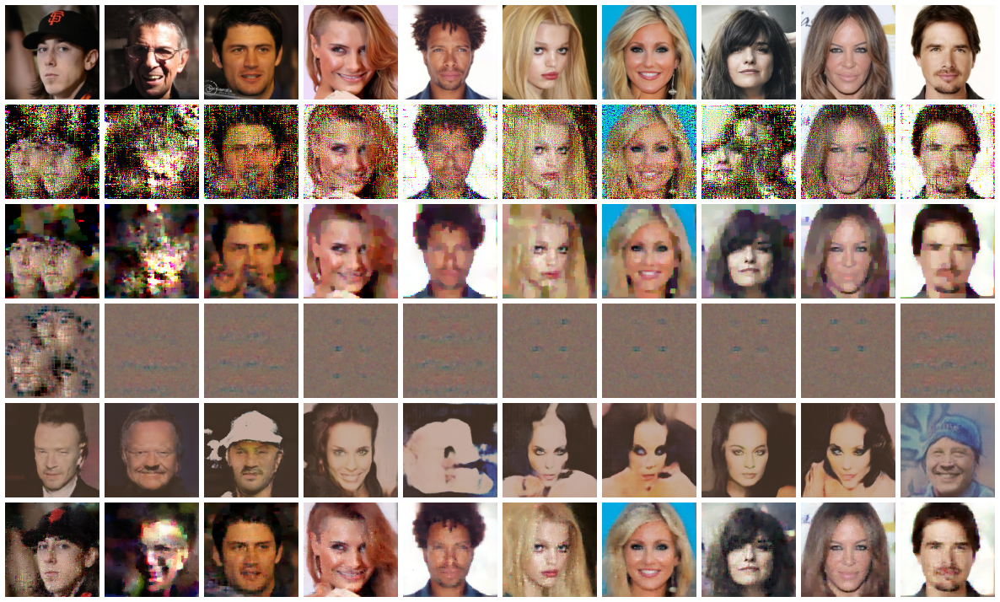

# Deep Face Leakage: Inverting High-quality Faces from Gradients Using Residual Optimization

## Introduction

The usage of facial data is becoming increasingly popular and to safeguard user privacy, large-scale facial applications necessitate the employment of privacy-preserving collaborative learning techniques to train and update deep learning models without sharing the original face images. Although current research has shown that exchanging gradients may compromise the privacy of training face images through gradient inversion attacks, these methods exhibit suboptimal performance in face reconstruction and result in the loss of numerous facial details. 

In this paper, we propose DFLeak, an effective approach to boost face leakage from gradients using residual optimization and thwart the privacy of facial applications in collaborative learning. In particular, we systemically enhance the performance of face reconstruction in three ways. First, we introduce a superior initialization method to stabilize the inversion process. Second, we propose to integrate blind face restoration results into the gradient inversion optimization process in a residual manner, which enriches facial details. Third, we design a pixel update schedule to efficiently reconstruct the face images. Comprehensive experimental results demonstrate that our method can reconstruct much more realistic and higher-quality face images and significantly surpass the performance of state-of-the-art gradient inversion attacks.


<p align="center">

</p>


## Getting started

### Requirements

`pip install -r requirements.txt`

### Preparation
1. Download datasets. Download [CelebAHQ](https://huggingface.co/datasets/huggan/CelebA-HQ), [LFW](http://vis-www.cs.umass.edu/lfw/), [FFHQ](https://drive.google.com/drive/folders/1JEOqxrhU_IhkdcRohdbuEtFETUxfNmNT?usp=sharing) and [ImageNet](https://www.image-net.org/).
2. Train victim models. Train ResNet18 on the CelebAHQ and LFW datasets for gender classification. We trained ResNet18 on 25 classes of ImageNet, you can also use the pre-trained model for evaluation.
3. Download the weights of blind face restoration models, see `breaching/attacks/bfr`.

### Run
1. Our approach first performs the initialzation search on the FFHQ dataset. For the CelebAHQ dataset,
```
#save gradients of ground truth
python main.py hydra.job.chdir=False case=11_single_celebahq_gender case.server.pretrained=False case.data.scale=112 case.data.path="data_path" state_dict_path="state_dict_path" num_trials=100 attack.save.out_dir="gradients/celebahq"

#search from candidates
python search.py

```

2. Run face construction benchmark
```

python main.py hydra.job.chdir=False case=11_single_celebahq_gender case.server.pretrained=False case.data.scale=112 case.data.path="data_path" state_dict_path="state_path" attack.init="real-specify" num_trials=100 +attack.img_base_dir="out/celeba_hq/search/112"

```
The reconstruction results will save in `outputs` directory, including the visual comparison and the results of each metric.


### Result


<p align="center">

</p>

<p align = "center">
The visual comparison with baselines in CelebAHQ and LFW. Row 1: GT, Row 2: iDLG-Adam, Row 3: InvertG, Row 4: GradInv, Row 5: GGL, Row 6: Ours.
</p>


## Acknowledgement

We express gratitude to the great work [breaching](https://github.com/JonasGeiping/breaching) and blind face restoration ([DifFace](https://github.com/zsyOAOA/DifFace), [CodeFormer](https://github.com/sczhou/CodeFormer) and [RestoreFormer](https://github.com/wzhouxiff/RestoreFormer)) as we benefit a lot from both their papers and codes.